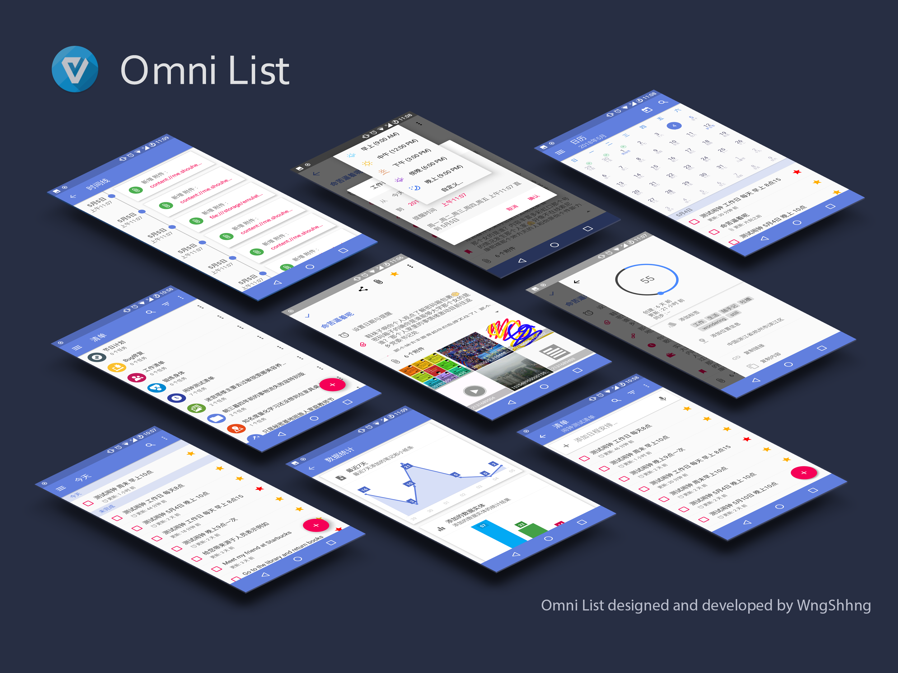
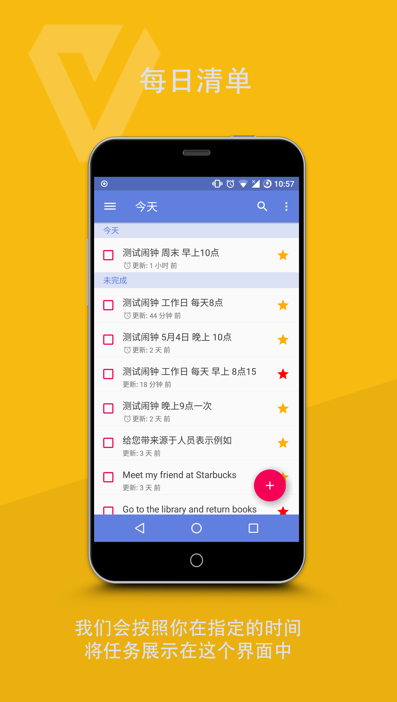
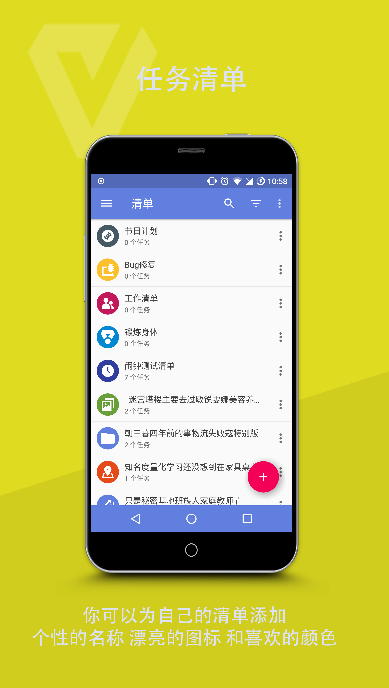
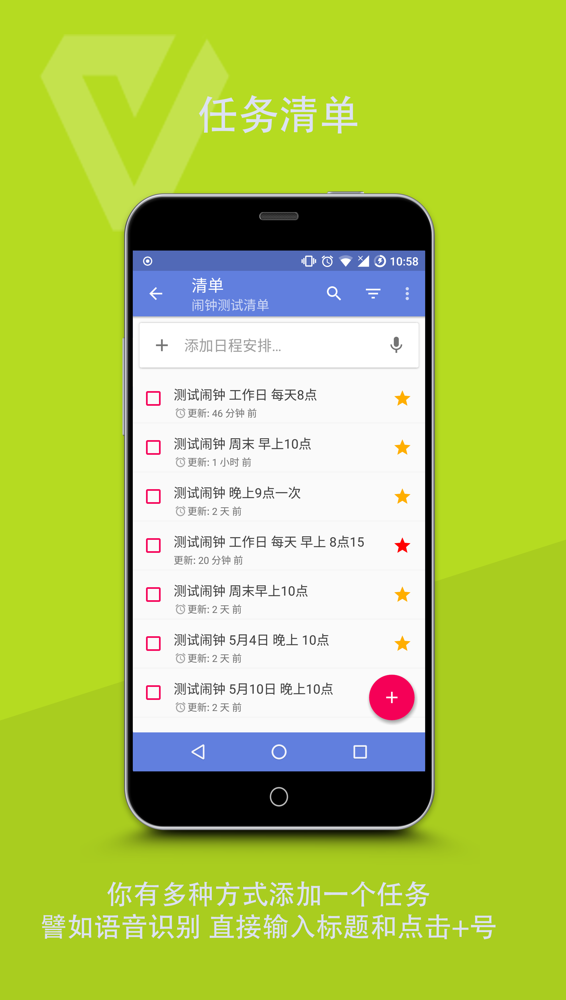
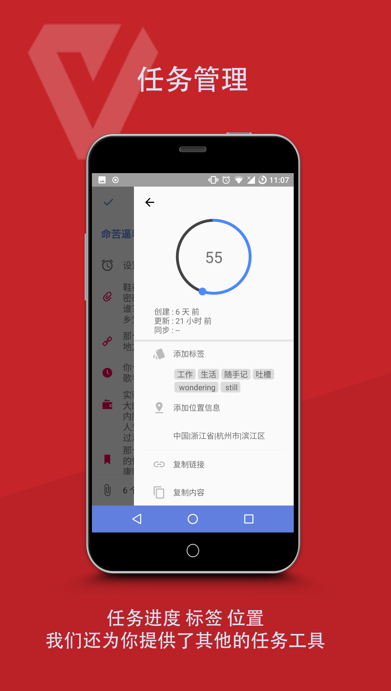
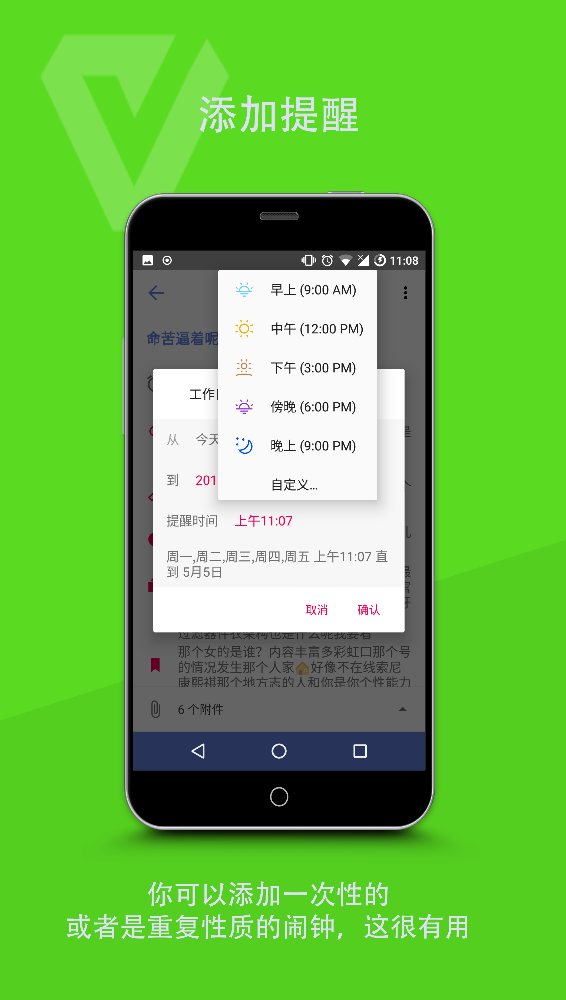
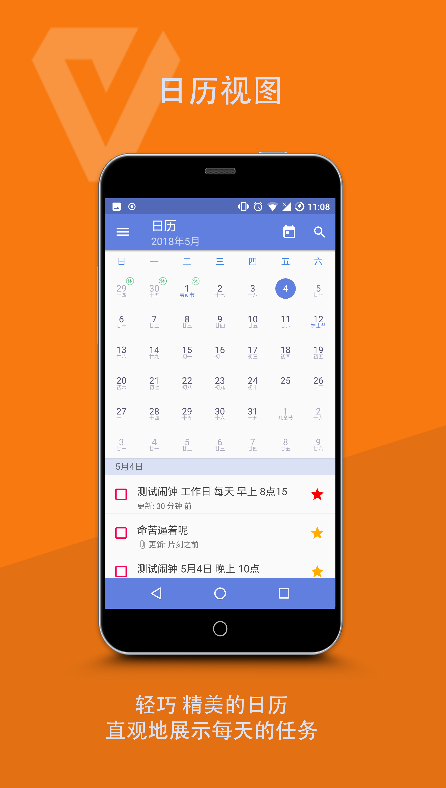
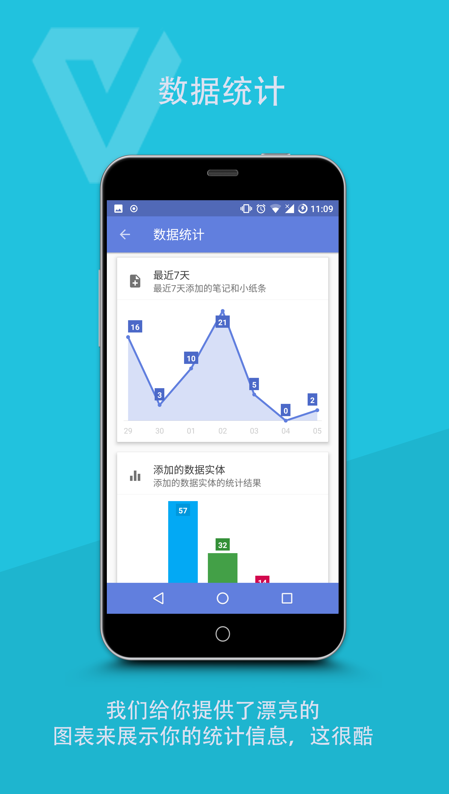
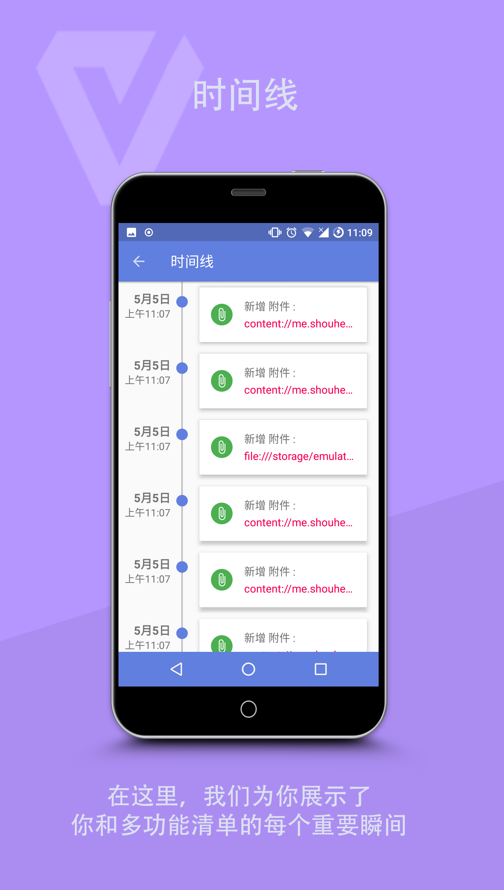

# Omni List

## 1、功能列表

- 【多种附件】允许添加多种格式的附件，包括录音 拍摄视频 拍照，也允许你手绘一些漂亮的图案，此外，它还允许你添加自己的位置信息；
- 【转换】多功能清单不止于TODO，同时你可以用它记录自己的简单想法，
甚至你可以使用Markdown语法来编辑，并通过预览将自己的任务转换成PDF HTML 或者 MD 等多种格式的文件；
- 【快捷方式】在多功能清单，你可以为任意的任务创建桌面快捷方式，你还可以使用我们精心为你准备的桌面小控件，
来展示自己的任务列表，从桌面发起请求创建任务，甚至可以在桌面直接创建任务；
- 【浮动按钮】除了快捷方式，多功能清单还允许你使用浮动按钮快速创建任务，你还可以自定义自己的浮动按钮；
- 【日历】日历当然是不能少的，我们为你准备了一个按月方式展示的日历，它还支持公历 农历 和 节假日等；
- 【清单管理】你常常为自己的任务管理一团乱麻而烦恼吗？那你可以尝试一下多功能清单的任务管理方式，
在这里，你可以为自己的清单添加可爱的图标和喜欢的颜色，庄重 美观 是我们一成不变的追求；
- 【滑动和拖拽】只有漂亮的清单当然还是不够的，在多功能清单，你还可以通过拖拽和滑动对任务进行管理。
我们为你提供了放进垃圾箱和归档两种操作，你可以放心地对任务进行管理；
- 【数据备份】备份，你可以将程序种的数据备份到手机的外部存储空间和OneDrive云空间，这很大程度上保障了你的数据安全；
- 【多主题】对于个性的你，多功能清单给你提供了16种强调色和16中主题色以及夜间主题的支持，让你随心搭配出自己的Style.
- 【时间线】时间线是用来记录你在程序中的重要瞬间的，比如当你完成了 更新了 归档了
或者删除了一个任务的时候，我们都会帮你记下这些重要的瞬间，你可以在任意时候回顾自己的心路和历程；
- 【提醒】你可以在多功能清单中为自己的任务添加多种提醒，比如重复的闹钟，或者指定日期的闹钟

## 2、截图

